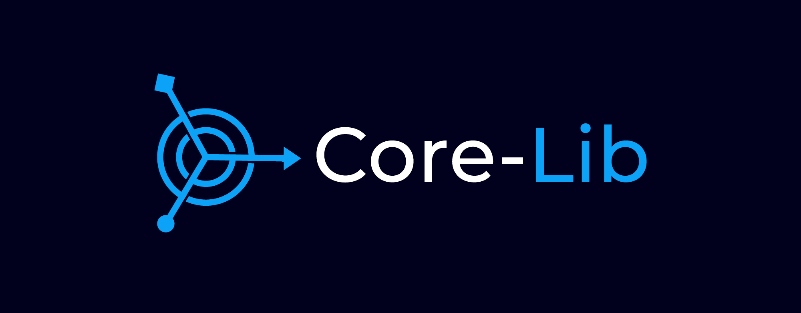

<p></p>

# Why Core-Lib?
`Core-Lib` was born to make the day-to-day work, The `"work itself."` easy to master.

# What is Core-Lib?
`Core-Lib` is a framework for creating Python applications as libraries. It is essentially a `POPO` (Plain Old Python Object) that serves as the central wrapper or facade for your application.

# How Core-Lib?
- `Core-Lib` is a plugin and plug-able to other Core-Libs. 
- `Core-Lib` can discover and merge other `Core-Lib's` configurations. 
- `Core-Lib` provides basic/simple/loose tools. 
- `Core-Lib` is not delegating third-party libraries. 
- `Core-Lib` unit-test the entire library.
- `Core-Lib` deploys anywhere.
- `Core-Lib` recommends architecture and guidelines. 

# What problems Core-Lib is solving:
#### **Code Chaos**:
Ending the cycle of repetitive code creation, ensuring longevity through structured development, and preventing code morphing with each developer's touch.
#### **Tight Coupling**:
Minimizing reliance on third-party dependencies by providing its own unique tools for managing multiple dependencies, enabling easy addition or removal of components. Ensuring smoother integration and maintenance of the system.
#### **Testing Trouble**:
Unit testing of your entire application, avoiding the need for complicated environments, setups, deployments, dependencies, and steep learning curves. Optimizing the testing process and saving time.
#### **Sluggish Deployment**:
Core-Lib is just code that can be run and tested easily anywhere.

## Installing

    pip install core-lib

## Requirements

    python > 3.7

## Running tests

    python -m unittest discover

## Example

### `your_core_lib.yaml`

```yaml
# @package _global_
core_lib:
  ...
	data:
    sqlalchemy:
      log_queries: false
      create_db: true      
      session:
        pool_recycle: 3600
        pool_pre_ping: false      
      url:
        protocol: sqlite
  ...
```
#### `your_core_lib.yaml` Explained:
**`your_core_lib.yaml` is the setting for your entire Core-Lib library. The above example will show how to configure core-lib to connect to a database using [SQLAlchemy](https://docs.sqlalchemy.org/en/20/){:target="_blank"}**:

- **`log_queries`**: Default `False`, `log_queries` represent and control the [echo flag](https://docs.sqlalchemy.org/en/20/core/engines.html#more-on-the-echo-flag){:target="_blank"} in `sqlalchemy`.

- **`create_db`**: Create all tables stored in this project-defined entities metadata.[1](https://docs.sqlalchemy.org/en/20/core/metadata.html#sqlalchemy.schema.MetaData.create_all){:target="_blank"}.

- **`session`**: It is a group to configure the `session` settings[1](https://docs.sqlalchemy.org/en/20/orm/session_basics.html){:target="_blank"}.

  - **`pool_recycle`**: Default `-1`, no timeout. Set to `specific the number of seconds` after which a connection will be recycled [1](https://docs.sqlalchemy.org/en/20/core/engines.html#sqlalchemy.create_engine.params.pool_recycle){:target="_blank"}[2](https://docs.sqlalchemy.org/en/20/core/pooling.html#setting-pool-recycle){:target="_blank"}.
  - **`pool_pre_ping`**: Default `False`. Set to `True` enables the connection pool “pre-ping” feature that tests connections for liveness upon each checkout[1](https://docs.sqlalchemy.org/en/20/core/engines.html#sqlalchemy.create_engine.params.pool_pre_ping){:target="_blank"}[2](https://docs.sqlalchemy.org/en/20/core/pooling.html#disconnect-handling-pessimistic){:target="_blank"}.

- **`url`**: Establishing a connection with the database. It can be defined in a single string or a structured format[1](https://docs.sqlalchemy.org/en/20/core/engines.html#database-urls){:target="_blank"}[2](https://docs.sqlalchemy.org/en/20/core/engines.html#sqlalchemy.engine.URL){:target="_blank"}.
```
data:
  sqlalchemy:
    log_queries: false
    url:
      protocol: postgresql
      username: ${oc.env:POSTGRES_USER}
      password: ${oc.env:POSTGRES_PASSWORD}
      host: ${oc.env:POSTGRES_HOST}
      port: ${oc.env:POSTGRES_PORT}
      file: ${oc.env:POSTGRES_DB}
```

### `your_core_lib.py`

```python
from core_lib.core_lib import CoreLib
from core_lib.connection.sql_alchemy_connection_registry import SqlAlchemyConnectionRegistry

class YourCoreLib(CoreLib):
    def __init__(self, config: DictConfig):
        CoreLib.__init__(self)
        db_connection = SqlAlchemyConnectionRegistry(self.config.core_lib.data.sqlalchemy)
        self.user = UserDataAccess(db_connection)
        ...
```
#### `your_core_lib.py` Explained:
**In `your_core_lib.py`, a `custom CoreLib class` and a `SqlAlchemyConnectionRegistry class` are defined to manage database connections.**

#### Defining a new class YourCoreLib that inherits from CoreLib.
  - Defining an `__init__` method for `YourCoreLib` that takes a config argument of type [DictConfig](https://omegaconf.readthedocs.io/en/2.3_branch/api_reference.html#id1){:target="_blank"}. It is a dictionary type from [omegaconf](https://omegaconf.readthedocs.io/en/2.3_branch/index.html){:target="_blank"} that used by [Hydra](https://hydra.cc/docs/intro/){:target="_blank"}.
  - Calling the parent class CoreLib's `__init__` method using `CoreLib.__init__(self)` to initialize the base class.
    - Mark core-lib as started
    - Enable the use of core-lib observers
  - Initialize a `db_connection` object by instantiating `SqlAlchemyConnectionRegistry` with the SQLAlchemy configuration fetched from `self.config.core_lib.data.sqlalchemy`, thereby connecting to and managing the specified database as defined in the `your_core_lib.yaml` configuration file.
  - Initializing a `UserDataAccess` class responsible for accessing user data from the database, passing the `db_connection` object to it.


### From Main

```python
@hydra.main(config_path='.', config_name='core_lib_config.yaml')
def main(cfg):
	your_core_lib = YourCoreLib(cfg)
  ...

if __name__ == '__main__':
	main()
```
#### `From Main` Explained:
**Using the [Hydra](https://hydra.cc/docs/intro/){:target="_blank"} library to manage configuration for your Core-Lib library.**

#### Decorator: @hydra.main:
- This decorator tells `Hydra` to use the specified `YAML` configuration file (`core_lib_config.yaml`) located in the current directory ('.') to configure your application. It's a convenient way to manage configurations for your Core-Lib library.
- **`def main(cfg)`**: This is the main function of your Core-Lib library, which takes a `cfg` argument. This argument will hold the configuration provided by `Hydra`.
#### Inside the main function:
  - **`your_core_lib = YourCoreLib(cfg)`**: This line initializes an instance of the `YourCoreLib` class (defined earlier) using the configuration `cfg` provided by `Hydra`. This means that your application will use the configuration parameters specified in `core_lib_config.yaml` to set up the `YourCoreLib` instance.

  - **`main()`**: This line calls the `main` function when the script is executed directly, starting the execution of your application.

### Unit-Test

```python
import unittest
import hydra
from hydra.core.global_hydra import GlobalHydra

def get_config():
  GlobalHydra.instance().clear()
  hydra.initialize(config_path=os.path.join('..', 'data', 'config'), caller_stack_depth=1)
  return hydra.compose('config.yaml')

config = get_config()

class TestCrud(unittest.TestCase):
	def setUp(self):
		self.your_core_lib = YourCoreLib(config)  
    
  def test_your_core_lib(self):
		user = self.your_core_lib.user.create({User.name.key: 'John Dow'})
    self.assertDictEqual(user, self.your_core_lib.user.get(user[User.id.key]))
```
#### Code Explained:
**Writing unit tests for your `YourCoreLib` class using the `unittest` framework, alongside Hydra for configuration management.**
- **Defining a function `get_config()` to use Hydra for loading testing `config.yaml` located under the testing folder.**
  - Clearing any existing `Hydra` configuration.
  - Initializing `Hydra` with a configuration path pointing to `../data/config and using config.yaml`.
  - Composing configuration and returning it.

- **Defining a test case class `TestCrud` that inherits from `unittest.TestCase`.**

  - **Implementing the setUp method**:
    - Called before each test method is executed.
    - Initializes an instance of `YourCoreLib` using the configuration obtained earlier and assigns it to `self.your_core_lib`.
- **Defining the test method `test_your_core_lib`**:

  - This method tests functionality related to creating and retrieving a user.
  - It creates a user using `self.your_core_lib.user.create()` method, passing in a dictionary with user data.
  - Then, it retrieves the user using `self.your_core_lib.user.get()` method with the user's ID obtained from the creation step.
  - Finally, it asserts that the retrieved user matches the created user.

### `your_core_lib_instance.py`

```python
class YourCoreLibInstance(object):
    _app_instance = None
    
    @staticmethod
    def init(core_lib_cfg):
        if not YourCoreLibInstance._app_instance:
          YourCoreLibInstance._app_instance = YourCoreLib(core_lib_cfg)

    @staticmethod
    def get() -> YourCoreLib:
        return YourCoreLibInstance._app_instance        
```
#### Code Explained:
**Implementing a singleton pattern for your YourCoreLib class using a separate class YourCoreLibInstance.**
- **`init(core_lib_cfg)`**:

  - This is a static method (decorated with @staticmethod) responsible for initializing the singleton instance of YourCoreLib.
  - It takes a `core_lib_cfg` argument, a configuration needed to initialize `YourCoreLib`.
  - If `_app_instance` is not already set (i.e., it's None), it initializes `_app_instance` by creating an instance of `YourCoreLib` with the provided configuration.
- **`get() -> YourCoreLib`**:
  - This is another static method responsible for returning the singleton instance of YourCoreLib.
  - It simply returns the `_app_instance`, which is the `singleton` instance of `YourCoreLib`.

### Flask

### `view_user.py`

```python
from flask import request, Flask
from http import HTTPStatus
from flask import jsonify
from your_core_lib_instance import YourCoreLibInstance

from core_lib.web_helpers.decorators import HandleException
from core_lib.web_helpers.flask.require_login import RequireLogin
from core_lib.web_helpers.request_response_helpers import request_body_dict, response_ok

app = Flask(__name__)
your_core_lib = YourCoreLibInstance.get()  # retrieve an instance of YourCoreLib
WebHelpersUtils.init(WebHelpersUtils.ServerType.Flask)

@app.route('/api/update_user', methods=['POST'])
@RequireLogin([])
@HandleException()
def api_update_user():
    your_core_lib.user.update(request.user.u_id, request_body_dict(request))
    return response_ok()


@app.route('/api/get_user', methods=['GET'])
@RequireLogin([])
@HandleException()
def api_get_user():
    user_data = your_core_lib.user.get(request.user.u_id, request_body_dict(request))
    return response_json(user_data)


if __name__ == "__main__":
    app.run(debug=True)

```
#### Code Explained:
**Defining API endpoints using `Flask` (or a similar framework) to handle requests related to updating a user.**

- **Importing necessary functions from `core_lib.web_helpers.request_response_helpers`**:
  - **`request_body_dict`**: A function that extracts and parses the request body into a dictionary.
  - **`response_ok`**: A function that generates a successful response with an appropriate status code.
  - **`response_status`**: A function that generates a response with a specified `HTTP` status code.
  - Getting the `singleton` instance of `YourCoreLib` using `YourCoreLibInstance.get()`. This ensures that you're using the same instance of YourCoreLib throughout your application.

- **`app = Flask(__name__)`**: Initialization Flask Application

- **`WebHelpersUtils.init(WebHelpersUtils.ServerType.Flask)`**: Initialization Server type, WebHelpersUtils identifies the type of response if it is `Flask / Django` type and returns it.

- **`Route Definitions`**:

  - **`api_update_user`**: Handles `POST` requests and updates user data using `your_core_lib.user.update()` method. It returns a successful response using `response_ok()`.
  - **`api_get_user`**: Handles `GET` requests and retrieves user data using `your_core_lib.user.get()` method. It returns the user data as a `JSON` response.

- Both route functions are decorated with `@RequireLogin([])` and `@HandleException()` decorators to enforce user authentication and handle exceptions.

- **`app.run(debug=True)`**: Start `Flask` application.

### Django

### `view_user.py`

```python
from core_lib.web_helpers.request_response_helpers import request_body_dict, response_ok, response_status

your_core_lib = YourCoreLibInstance.get() # retrieve an instance of YourCoreLib
WebHelpersUtils.init(WebHelpersUtils.ServerType.DJANGO)

@require_POST
@RequireLogin()
@HandleException()
def api_update_user(request):
    your_core_lib.user.update(request.user.u_id, request_body_dict(request))
    return response_status(HTTPStatus.NO_CONTENT)

@require_GET
@RequireLogin()
@HandleException()
def api_update_user(request):
    your_core_lib.user.update(request.user.u_id, request_body_dict(request))
    return response_ok()
```
#### Code Explained:
- **Importing necessary functions from `core_lib.web_helpers.request_response_helpers`**:
  - **`request_body_dict`**: A function that extracts and parses the request body into a dictionary.
  - **`response_ok`**: A function that generates a successful response with an appropriate status code.
  - **`response_status`**: A function that generates a response with a specified `HTTP` status code.
  - Getting the `singleton` instance of `YourCoreLib` using `YourCoreLibInstance.get()`. This ensures that you're using the same instance of YourCoreLib throughout your application.

- **`WebHelpersUtils.init(WebHelpersUtils.ServerType.Django)`**: Initialization Server type, WebHelpersUtils identifies the type of response if it is `Flask / Django` type and returns it.

- **Defining two API endpoint functions**:
  - <i>**api_update_user (for POST requests)**:</i>
    - **`Decorated with @require_POST`**: This decorator ensures that the endpoint only responds to POST requests.
    - **`Decorated with @RequireLogin()`**: This decorator ensures that the user must be logged in to access this endpoint.
    - **`Decorated with @HandleException()`**: This decorator handles any exceptions that occur within the endpoint function.
    - Inside the function, `your_core_lib.user.update()` is called to update the user information using the data from the request body (`request_body_dict(request)`).
    - Finally, it returns a response with `HTTP` status code `NO_CONTENT` using response_status (`HTTPStatus.NO_CONTENT`).
  - <i>**api_update_user (for GET requests)**:</i>
    - **`Decorated with @require_GET`**: This decorator ensures that the endpoint only responds to GET requests.
    - **`Decorated with @RequireLogin()`**: This decorator ensures that the user must be logged in to access this endpoint.
    - **`Decorated with @HandleException()`**: This decorator handles any exceptions that occur within the endpoint function.
    - Inside the function, `your_core_lib.user.update()` is called to update the user information using the data from the request body (`request_body_dict(request)`).
    - Finally, it returns a successful response using `response_ok()`.

## The source

[https://github.com/shay-te/core-lib](https://github.com/shay-te/core-lib){:target="_blank"}

## Example project

[https://github.com/shay-te/core-lib/examples](https://github.com/shay-te/core-lib/examples){:target="_blank"}

## Contributing

Please read [CONTRIBUTING.md](https://gist.github.com/PurpleBooth/b24679402957c63ec426){:target="_blank"} for details on our code of conduct and the process for submitting pull requests to us.


## Authors

**Shay Tessler**  - [GitHub](https://github.com/shay-te){:target="_blank"}


## License

This project is licensed under the MIT - see the [LICENSE](https://github.com/shay-te/core-lib/blob/master/LICENSE){:target="_blank"} file for details.