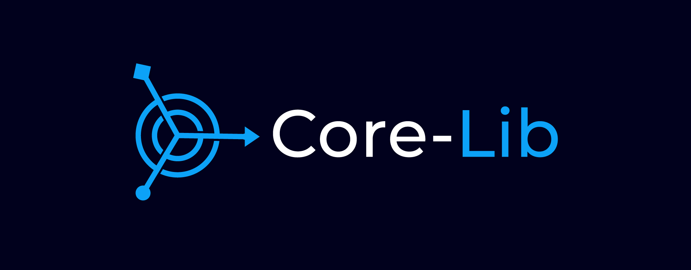

<p></p>

---

**Core-Lib keeps Flask, SQLAlchemy, and external services out of your business logic — so changing them doesn't mean rewriting your app.**

Without this separation, those dependencies spread through your codebase — and every future change gets more expensive.

---

## The framework that killed the project

A team built a complete production system on Play Framework 1.2. Controllers, models, business logic — all of it written to Play's API. It worked. Shipped. Users depended on it.

Then Play 2.0 came out. Completely different architecture. Not an upgrade — a rewrite. The migration cost was indistinguishable from rebuilding the product from scratch.

**The project was dropped.**

It didn't look tightly coupled until they tried to change it.

The framework didn't fail them. The coupling did. When the framework changed, there was no separation between "the thing we built" and "the thing we built it on."

Most teams don't get killed by one big rewrite. They get slowed down by hundreds of small places where framework code leaked into business code — until the day a major version drops and all of those places need to change at once.

This is what Core-Lib is designed to prevent.

---

## What Core-Lib is

Core-Lib is an **application-structure framework** for Python backends. It standardizes how you wire services, data access, external clients, jobs, and tests — so your business logic stays independent from Flask, Django, SQLAlchemy, and everything else you build on top of.

Think of Core-Lib as the place where your application lives — and everything else (web frameworks, databases, APIs) plugs into it from the outside.

Core-Lib doesn't invent a new pattern — it enforces one consistently across your entire application.

Your entire backend lives in a class that inherits from `CoreLib`. That class has no knowledge of any web framework or database library. It is just Python. The framework sits on top and calls into it.

```python
class UserCoreLib(CoreLib):
    def __init__(self, config: DictConfig):
        CoreLib.__init__(self)
        db = SqlAlchemyConnectionFactory(config.core_lib.data.db)  # connection at the edge
        self.user = UserService(      # business logic
            UserDataAccess(db)        # database queries
        )
```

When the framework beneath you changes — and it will — you replace the thin web layer. Your services, your data access, and most of your tests stay the same.

```python
# Flask today
@app.route('/api/user')
def get_user():
    return response_json(app_instance.user.get(request.user.id))

# FastAPI tomorrow — UserService didn't change, not one line
@router.get('/api/user')
def get_user():
    return app_instance.user.get(current_user.id)
```

---

## What Core-Lib is not

**Not a web framework.** Core-Lib is not in the same space as FastAPI or Django. No router, no request lifecycle. It works alongside any web framework — you bring the web layer, Core-Lib handles everything behind it.

**Not a replacement for SQLAlchemy, Redis, or MongoDB.** Core-Lib adds a dependency in order to remove coupling. It is not there to hide Flask or SQLAlchemy — it is there to stop them from spreading through your entire codebase. You still write SQLAlchemy models. You still use Redis commands. Core-Lib handles the connection lifecycle and gives you consistent patterns around them.

**Not opinionated about your domain.** It gives you structure for the layers, not rules about what goes inside them.

---

## When to use Core-Lib

Use it when:
- Your backend will live for years, not weeks
- Multiple engineers will touch the same codebase
- You want to run the same business logic from web requests, background jobs, scripts, and tests
- You need to swap infrastructure (DB, cache, HTTP client) without touching business logic

Don't use it when:
- Your app is a prototype, script, or simple CRUD app
- There's no long-term maintenance expectation
- Your app is small and unlikely to change much

---

## Why not just use SQLAlchemy (or Flask, or Redis) directly?

You can. And for a small script, you should.

The problem appears at scale. When you use SQLAlchemy directly across 40 files, your business logic is coupled to database sessions. When you use Flask's `request` object in your service layer, your service layer can't run without Flask. When your tests need a real Redis instance to start, your test suite becomes slow and fragile.

You don't notice the problem when writing code. You notice it when you try to change it.

Core-Lib draws a hard line: database sessions, HTTP clients, and external services are wired in at startup via config, not imported across your codebase. Your service layer never touches a session object. Your tests spin up the full application against SQLite and a mock HTTP client — no Docker, no external services, no environment setup.

When you need to swap Postgres for MySQL, or Redis for Memcached, or one payment provider for another — the change stays in wiring code instead of spreading through business logic.

---

## Why not just enforce this with discipline, without the library?

You can do that too. Core-Lib exists because teams rarely keep these boundaries clean by convention alone. Architecture drift happens gradually — one shortcut here, one imported session there — until the boundaries are gone.

Core-Lib makes the right structure the path of least resistance. It provides:

- A standard connection lifecycle for every supported database and cache
- A bootstrapping pattern that works identically from web, job, script, and test
- Config-driven wiring — swap any collaborator by changing YAML, not code
- Test helpers that initialize the full app with a single config override
- A shared vocabulary (`Service`, `DataAccess`, `Client`, `Job`) that makes architecture decisions explicit across the team

Without that, the correct architecture depends on every engineer remembering it every day.

---

## The layers

```
CoreLib              your application — the single entry point
  ├── Service            business logic and orchestration
  ├── DataAccess         database queries
  │     └── Connection       sessions and connection pooling
  ├── Client             HTTP clients and third-party API wrappers
  └── Job                scheduled or background tasks
```

Every tool in Core-Lib exists to serve one of these layers. Services don't know about database sessions. DataAccess doesn't know about business rules. Clients don't know about services. The structure is a shared mental model the whole team can reason about.

---

## A real scenario: launching a B2B tier

Your app starts as B2C — one database, one payment provider, one user type. Then you land enterprise customers who need their own isolated database, a different payment flow, and SSO login.

Without Core-Lib, "enterprise support" means grepping for every place Stripe is called, every place the database session is used, every place the user model is assumed. That's not a feature. That's a partial rewrite.

With Core-Lib, your `YourCoreLib.__init__` reads from config. The enterprise instance gets a different config — different DB connection, different payment client, different auth handler. The business logic that creates orders, processes users, and sends emails doesn't change.

```python
# consumer instance
consumer_app = YourCoreLib(consumer_config)  # SQLite, Stripe, cookie auth

# enterprise instance — same class, different wiring
enterprise_app = YourCoreLib(enterprise_config)  # Postgres, invoice billing, SSO
```

---

## A minimal example

### `your_core_lib.yaml`

```yaml
# @package _global_
core_lib:
  your_core_lib:
    data:
      db:
        log_queries: false
        create_db: true
        url:
          protocol: sqlite
```

### `your_core_lib.py`

```python
from omegaconf import DictConfig
from core_lib.core_lib import CoreLib
from core_lib.connection.sql_alchemy_connection_factory import SqlAlchemyConnectionFactory

class YourCoreLib(CoreLib):
    def __init__(self, config: DictConfig):
        CoreLib.__init__(self)
        db = SqlAlchemyConnectionFactory(config.core_lib.your_core_lib.data.db)
        self.user = UserService(      # business logic
            UserDataAccess(db)        # database queries
        )
```

### `main.py`

```python
import hydra
from omegaconf import DictConfig

@hydra.main(config_path='.', config_name='your_core_lib.yaml')
def main(cfg: DictConfig):
    app = YourCoreLib(cfg)

if __name__ == '__main__':
    main()
```

### Flask

`YourCoreLibInstance.get()` returns the singleton initialized at startup — one instance for the entire app, shared across all request handlers. `request.user` is populated by the `RequireLogin` decorator.

```python
from core_lib.web_helpers.request_response_helpers import request_body_dict, response_ok, response_json
from core_lib.web_helpers.decorators import HandleException
from core_lib.web_helpers.flask.require_login import RequireLogin

app = Flask(__name__)
your_core_lib = YourCoreLibInstance.get()  # singleton, created once at startup
WebHelpersUtils.init(WebHelpersUtils.ServerType.Flask)

@app.route('/api/user', methods=['GET'])
@RequireLogin([])
@HandleException()
def api_get_user():
    return response_json(your_core_lib.user.get(request.user.u_id))

@app.route('/api/user', methods=['POST'])
@RequireLogin([])
@HandleException()
def api_update_user():
    your_core_lib.user.update(request.user.u_id, request_body_dict(request))
    return response_ok()
```

### Django

`YourCoreLibInstance.get()` returns the singleton initialized at startup. `request.user` is populated by the `RequireLogin` decorator.

```python
from core_lib.web_helpers.request_response_helpers import request_body_dict, response_ok, response_json

your_core_lib = YourCoreLibInstance.get()  # singleton, created once at startup
WebHelpersUtils.init(WebHelpersUtils.ServerType.DJANGO)

@require_GET
@RequireLogin()
@HandleException()
def api_get_user(request):
    return response_json(your_core_lib.user.get(request.user.u_id))

@require_POST
@RequireLogin()
@HandleException()
def api_update_user(request):
    your_core_lib.user.update(request.user.u_id, request_body_dict(request))
    return response_ok()
```

---

## Testing

Tests initialize the same `CoreLib` class with a config that points to SQLite and mock clients. No Docker. No external services. No test environment to maintain.

```python
import unittest
from core_lib.helpers.test import load_core_lib_config

class TestUserService(unittest.TestCase):
    def setUp(self):
        config = load_core_lib_config('./tests/config', 'test_config.yaml')
        self.app = YourCoreLib(config)

    def test_create_and_retrieve_user(self):
        user = self.app.user.create({'name': 'Jane'})
        self.assertEqual(self.app.user.get(user['id'])['name'], 'Jane')
```

The test config overrides only what differs from production:

```yaml
# tests/config/test_config_override.yaml
core_lib:
  your_core_lib:
    data:
      db:
        url:
          protocol: sqlite   # in-memory SQLite instead of production Postgres
```

---

## Installing

```bash
pip install core-lib
```

**Requirements:** Python > 3.7

## Running tests

```bash
python -m unittest discover
```

## Source

[https://github.com/shay-te/core-lib](https://github.com/shay-te/core-lib){:target="_blank"}

## Contributing

Please read [CONTRIBUTING.md](https://gist.github.com/PurpleBooth/b24679402957c63ec426){:target="_blank"} for details on the code of conduct and the process for submitting pull requests.

## Author

**Shay Tessler** — [GitHub](https://github.com/shay-te){:target="_blank"}

## License

MIT — see the [LICENSE](https://github.com/shay-te/core-lib/blob/master/LICENSE){:target="_blank"} file for details.

<div style="margin-top:2em">
  <button class="pageNext-btn"><a href="/advantages.html">Next >></a></button>
</div>
