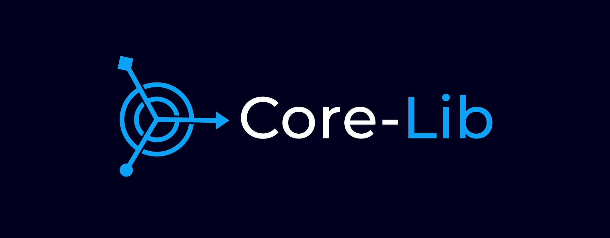

<p></p>

---

**Core-Lib is a Python application skeleton. Your application is exposed through one `CoreLib` class — business logic stays in services; web frameworks, databases, and external services plug in from the outside.**

When Flask, SQLAlchemy, or your payment provider changes, the change stays at the edge of your app. It doesn't ripple through forty files.

```text
Web / Jobs / Tests  →  CoreLib  →  Service  →  DataAccess  →  Database
                                      │
                                      └──→  Client  →  External API
```

In plain English:

- Route handlers, jobs, and tests all call the same `CoreLib` object.
- `CoreLib` wires the app.
- `Service` owns business logic.
- `DataAccess` and `Client` hide infrastructure from the service.

## The layers

| Layer | Purpose | Never does |
|---|---|---|
| `CoreLib` | Single entry point. Created once when your app boots; wires everything below it. | Hold business logic. |
| `Service` | Business logic. Calls into `DataAccess` and `Client`. | Open DB sessions or HTTP clients directly. |
| `DataAccess` | Queries against one model, collection, index, or data source. | Run business rules. |
| `Client` | HTTP / third-party API wrapper. | Hold business logic. |
| `Job` | Background or scheduled task. Receives the dependencies it needs at construction. | Get called from a web route. |
| `Connection` | Manages the session lifecycle (open / commit / close) for SQLAlchemy, MongoDB, Solr, Neo4j, Elasticsearch, and more. | Contain business rules or request logic. |

Most Core-Lib apps use these six layers. The next section shows the core path — `CoreLib → Service → DataAccess → Connection → Database` — in one runnable file.

---

## A complete Core-Lib app in one file

```python
# hello_core_lib.py — single file, copy and run
from core_lib.core_lib import CoreLib
from core_lib.connection.sql_alchemy_connection_factory import SqlAlchemyConnectionFactory
from core_lib.data_layers.data.db.sqlalchemy.base import Base
from core_lib.data_layers.data_access.db.crud.crud_data_access import CRUDDataAccess
from core_lib.data_layers.service.service import Service
from omegaconf import OmegaConf
from sqlalchemy import Column, Integer, VARCHAR


class User(Base):                                # ORM model used by DataAccess
    __tablename__ = 'user'
    id = Column(Integer, primary_key=True)
    name = Column(VARCHAR(255), nullable=False)


class UserDataAccess(CRUDDataAccess):            # DataAccess: queries
    def __init__(self, db):
        super().__init__(User, db)


class UserService(Service):                      # Service: business logic
    def __init__(self, da):
        self.da = da

    def create(self, name):
        return self.da.create({'name': name})

    def greet(self, user_id):
        return f"Hello, {self.da.get(user_id).name}!"


class HelloApp(CoreLib):                         # CoreLib: wires it all
    def __init__(self, config):
        super().__init__()
        db = SqlAlchemyConnectionFactory(config.db)
        self.user = UserService(UserDataAccess(db))


config = OmegaConf.create({'db': {'create_db': True, 'url': {'protocol': 'sqlite'}}})
app = HelloApp(config)

jane = app.user.create('Jane')
print(app.user.greet(jane.id))   # Hello, Jane!
```

`pip install core-lib`, save the file, run it. SQLite runs in-memory — no database server, no Docker, no config files. Each class maps onto one row of the table above.

**Next steps for a real app:** move config into a YAML file ([The CoreLib Class](/core_lib_main_class.html)), split the file across folders ([Project Structure](/project_structure.html)), plug a web framework on top ([Web Helpers](/web.html)), and write tests against SQLite ([Testing Core-Lib](/test_core_lib.html)).

The rest of this page explains *why* you would structure code this way.

---

## When to use Core-Lib

**Use it when:**
- Your backend will live for years, not weeks
- Multiple engineers will touch the same codebase
- You want to run the same business logic from web requests, background jobs, scripts, and tests
- You need to swap infrastructure (DB, cache, HTTP client) without touching business logic

**Don't use it when:**
- Your app is a prototype, script, or simple CRUD app
- There's no long-term maintenance expectation
- Your app is small and unlikely to change much

---

## Why this pays off: framework changes don't reach your Service

Because the web layer only calls `app.user.get(...)`, swapping Flask for FastAPI is a thin-layer change. `UserService` doesn't move, not one line.

```python
# Flask today
@app.route('/api/user')
def get_user():
    return response_json(app.user.get(request.user.id))

# FastAPI tomorrow — UserService didn't change, not one line
@router.get('/api/user')
def get_user():
    return app.user.get(current_user.id)
```

---

## What Core-Lib is not

**Not a web framework.** It is not in the same space as FastAPI or Django. No router, no request lifecycle. It works alongside any web framework — you bring the web layer, Core-Lib handles everything behind it.

**Not a replacement for SQLAlchemy, Redis, or MongoDB.** You still write SQLAlchemy models. You still use Redis commands. Core-Lib does not hide them — it stops them from spreading through your entire codebase.

**Not opinionated about your domain.** It gives you structure for the layers, not rules about what goes inside them.

---

## "Yes, it adds a layer. What do I get for it?"

Core-Lib does add a dependency. The trade-off is deliberate, and here is what you get in return:

- **One place where infrastructure is created.** Connections, clients, and caches are constructed in `CoreLib.__init__` and nowhere else. Your service code never imports a session, a Redis client, or a Stripe SDK.
- **The same business logic runs from web requests, jobs, scripts, and tests.** No duplicate wiring, no `if running_in_tests:` branches.
- **Tests boot the full app against SQLite and mock clients with one config override.** No Docker, no fixtures for external services.
- **Config-driven swaps.** Postgres → MySQL, Memcached → Redis, payment provider A → B happens in YAML, not across business logic — assuming each provider is wrapped behind the same `Client` interface (e.g. `charge_customer()`, `create_subscription()`). Core-Lib gives you the seam; you write the adapter.

If your app is a script or a prototype, you should not pay this cost — see "When to use Core-Lib" above.

---

## "But Core-Lib still leaks the third-party library through."

Yes — and that is the point.

Core-Lib is **not** an abstraction layer over SQLAlchemy or PyMongo. It does not invent a new query API. Inside a `with db.get() as session:` block, `session` is a real `sqlalchemy.orm.Session`. Inside `with mongo.get() as client:`, you get a real `MongoClient`. The same pattern, the same skills, the same docs — but the lifecycle (open, commit, close) is handled for you.

What Core-Lib **does** standardize is the seam: every data source, regardless of vendor, is wrapped in the same `with conn.get() as x:` context manager and constructed at the edge of the app. Your business logic only depends on a `DataAccess` class, not on whichever library is behind it. Swapping the library is a wiring change; the call sites do not move.

It is a structural framework, not a vendor-neutral data layer. If you wanted the latter, this is not it — and that is intentional.

---

## Without Core-Lib vs. with Core-Lib

Real-world version of the same pattern as the Hello, World above. Here the Service talks to a database and a third-party API.

```python
# Without Core-Lib — the Service can only run inside Flask, against the live DB,
# with the real Stripe SDK. Tests need all three.
from flask import request
from app.db import session
import stripe

def create_subscription(plan):
    customer = stripe.Customer.create(email=request.json['email'])
    session.add(Subscription(user_id=request.user.id, plan=plan, ext_id=customer.id))
    session.commit()
    return {'ok': True}
```

```python
# With Core-Lib — the Service receives its collaborators. Same code runs from
# Flask, FastAPI, a background job, or a test with mocked clients.
class SubscriptionService(Service):
    def __init__(self, sub_da, billing_client):
        self.sub_da = sub_da
        self.billing_client = billing_client

    def create(self, user_id, email, plan):
        customer = self.billing_client.create_customer(email)
        return self.sub_da.create(user_id, plan, customer.id)
```

The route handler does the framework-specific work (reading `request`, returning a response). The Service does business logic. Nothing in `SubscriptionService` knows what web framework, what database, or which payment provider is behind it.

---

## A real scenario: launching a B2B tier

Your app starts as B2C — Postgres, Stripe, cookie auth, one user type. Then you land enterprise customers who need an isolated database, invoice-based billing, and SSO login.

Without Core-Lib, "enterprise support" means grepping for every place Stripe is called, every place the session is used, every place the user model is assumed. That's not a feature. That's a partial rewrite.

With Core-Lib, `UserService`, `OrderService`, and `SubscriptionService` don't change at all. You wire two instances of the same class with two configs:

```python
# Consumer: shared Postgres, Stripe, cookie auth
consumer_app = YourCoreLib(consumer_config)

# Enterprise: per-tenant Postgres, invoice billing client, SAML auth handler
enterprise_app = YourCoreLib(enterprise_config)

consumer_app.subscription.create(user_id=42, email='jane@acme.com', plan='pro')
enterprise_app.subscription.create(user_id=42, email='jane@acme.com', plan='enterprise')
# Same SubscriptionService code; different SubscriptionDataAccess and BillingClient under it.
```

The condition: enterprise's `BillingClient` exposes the same methods (`create_customer`, `charge`, …) as Stripe's. The `Client` adapter is the work — but it's local work, in one file, not scattered through the codebase.

---

## Testing

Tests initialize the same `CoreLib` class with a config that points to SQLite and mock clients. No Docker. No external services. No test environment to maintain.

```python
import unittest
from core_lib.helpers.test import load_core_lib_config

class TestUserService(unittest.TestCase):
    def setUp(self):
        config = load_core_lib_config('./tests/config', 'test_config.yaml')
        self.app = YourCoreLib(config)

    def test_create_and_retrieve_user(self):
        user = self.app.user.create({'name': 'Jane'})
        self.assertEqual(self.app.user.get(user['id'])['name'], 'Jane')
```

See [Testing Core-Lib](/test_core_lib.html) for the full pattern, including how to share an instance across test files.

---

## The framework that killed the project

A team built a complete production system on Play Framework 1.2. Controllers, models, business logic — all written to Play's API. It worked. Shipped. Users depended on it.

Then Play 2.0 came out — completely different architecture. Not an upgrade. A rewrite. The migration cost was indistinguishable from rebuilding the product from scratch.

**The project was dropped.**

The framework didn't fail them. The coupling did. When the framework changed, there was no separation between "the thing we built" and "the thing we built it on."

Most teams don't get killed by one big rewrite. They get slowed down by hundreds of small places where framework code leaked into business code — until the day a major version drops and all of those places need to change at once.

This is what Core-Lib is designed to prevent.

---

## Installing

```bash
pip install core-lib
```

**Requirements:** Python > 3.7

## Running tests

```bash
python -m unittest discover
```

## Source

[https://github.com/shay-te/core-lib](https://github.com/shay-te/core-lib){:target="_blank"}

## Contributing

Please read [CONTRIBUTING.md](https://gist.github.com/PurpleBooth/b24679402957c63ec426){:target="_blank"} for details on the code of conduct and the process for submitting pull requests.

## Author

**Shay Tessler** — [GitHub](https://github.com/shay-te){:target="_blank"}

## License

MIT — see the [LICENSE](https://github.com/shay-te/core-lib/blob/master/LICENSE){:target="_blank"} file for details.

<div style="margin-top:2em">
  <button class="pageNext-btn"><a href="/advantages.html">Next >></a></button>
</div>
