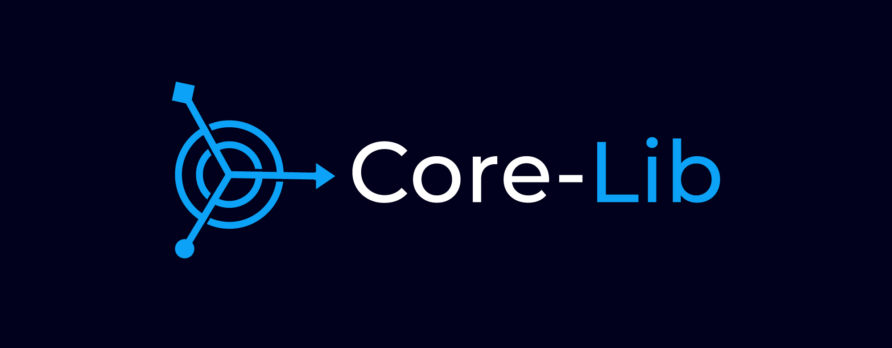

<p></p>

---

**Core-Lib is a Python library for structuring backends.** You wire your services, data access and API clients once, in one `CoreLib` class. Your web routes, background jobs, scripts and tests all call that same object.

**It is not a web framework and not an ORM.** You keep Flask, Django or FastAPI, and you keep SQLAlchemy. Core-Lib gives that code a fixed place to live, so framework and database code stays at the edges and replacing one of them touches the edges, not your business logic.

```text
Web / Jobs / Tests  →  CoreLib  →  Service  →  DataAccess  →  Database
                                      │
                                      └──→  Client  →  External API
```

**If you know the patterns:** this is ports and adapters (with the repository pattern for data) and a single composition root, plus the plumbing around them. It is not a DI container: you wire objects by hand in `__init__`, with no providers and no auto-wiring. Django users: the data layer is SQLAlchemy, used beside the Django ORM, not on top of it.

## The layers

| Layer | Purpose | Never does |
|---|---|---|
| `CoreLib` | Single entry point. Created once when your app boots; wires everything below it. | Hold business logic. |
| `Service` | Business logic. Calls into `DataAccess` and `Client`. | Open DB sessions or HTTP clients directly. |
| `DataAccess` | Queries against one model, collection, index, or data source. | Run business rules. |
| `Client` | HTTP / third-party API wrapper. | Hold business logic. |
| `Job` | Background or scheduled task, declared in YAML and scheduled by `load_jobs()`. Gets your `CoreLib` in `initialized(data_handler)` and calls its services from `run()`. | Hold business logic itself; get called from a web route. |
| `Connection` | Manages the session lifecycle (open / commit / close) for SQLAlchemy, MongoDB, Solr, Neo4j, Elasticsearch, and more. | Contain business rules or request logic. |

These are conventions, not rules the library checks: `Service` and `DataAccess` are empty base classes. The next section shows the core path, `CoreLib → Service → DataAccess → Connection → Database`, in one runnable file.

---

## A complete Core-Lib app in one file

```python
# hello_core_lib.py — one file, copy and run
from omegaconf import OmegaConf
from sqlalchemy import Column, Integer, VARCHAR

from core_lib.core_lib import CoreLib
from core_lib.connection.sql_alchemy_connection_factory import SqlAlchemyConnectionFactory
from core_lib.data_layers.data.db.sqlalchemy.base import Base
from core_lib.data_layers.data_access.db.crud.crud_data_access import CRUDDataAccess
from core_lib.data_layers.service.service import Service
from core_lib.data_transform.result_to_dict import ResultToDict


class User(Base):                                # Entity: a SQLAlchemy model
    __tablename__ = 'user'
    id = Column(Integer, primary_key=True)
    name = Column(VARCHAR(255), nullable=False)


class UserDataAccess(CRUDDataAccess):            # DataAccess: create/get/update/delete
    def __init__(self, db):
        super().__init__(User, db)


class UserService(Service):                      # Service: business logic
    def __init__(self, user_data_access: UserDataAccess):
        self._user_data_access = user_data_access

    @ResultToDict()                              # callers get a plain dict
    def create(self, name: str) -> dict:
        return self._user_data_access.create({User.name.key: name})

    def greet(self, user_id: int) -> str:
        return f'Hello, {self._user_data_access.get(user_id).name}!'


class HelloApp(CoreLib):                         # CoreLib: wires it all, once
    def __init__(self, config):
        super().__init__()
        db = SqlAlchemyConnectionFactory(config.db)
        self.user = UserService(UserDataAccess(db))


config = OmegaConf.create({'db': {'create_db': True, 'url': {'protocol': 'sqlite'}}})

if __name__ == '__main__':
    hello_app = HelloApp(config)
    jane = hello_app.user.create('Jane')
    print(hello_app.user.greet(jane[User.id.key]))   # Hello, Jane!
```

`pip install core-lib` (Python 3.10+), save the file, run `python hello_core_lib.py`. It prints `Hello, Jane!`. SQLite runs in memory: no database server, no Docker, no config files. The `if __name__ == '__main__':` guard lets a web app or a test import `HelloApp` without running the demo.

**What Core-Lib did for you here:**

- `CRUDDataAccess` gave `UserDataAccess` its `create`, `get`, `update` and `delete`. `get` raises a 404 `StatusCodeException` when the row does not exist.
- `SqlAlchemyConnectionFactory` built the engine, created the tables (`create_db: True`), and opened, committed and closed a session for every call.
- `@ResultToDict()` turned the new `User` row into a plain dict.

**Next steps for a real app:** move the config into a YAML file and create the object once at startup ([The CoreLib Class](core_lib_main_class.html)), split the file across folders ([Project Structure](project_structure.html)), and write tests ([Testing Core-Lib](test_core_lib.html)).

> **Prerequisites.** These docs assume working familiarity with a Python web framework (Flask or Django) and SQLAlchemy. If a term is unfamiliar, check the [Glossary](glossary.html). If you're new to Python web development, start with the [Flask quickstart](https://flask.palletsprojects.com/en/latest/quickstart/){:target="_blank"} and [SQLAlchemy intro](https://docs.sqlalchemy.org/en/latest/orm/quickstart.html){:target="_blank"} first.

---

## Calling it from Flask or FastAPI

Create the `CoreLib` object once per process, at startup, and call it from your routes. The routes are the only code that knows which web framework you use.

```python
# web.py — the same HelloApp behind Flask and behind FastAPI
from fastapi import FastAPI
from flask import Flask
from omegaconf import OmegaConf

from hello_core_lib import HelloApp

# A SQLite file instead of in-memory: web servers answer requests on worker threads,
# and an in-memory SQLite database only exists in the thread that created it.
config = OmegaConf.create({'db': {'create_db': True, 'url': {'protocol': 'sqlite', 'file': 'hello.db'}}})
hello_app = HelloApp(config)    # once per process, at startup, never per request

# Flask
flask_app = Flask(__name__)

@flask_app.get('/users/<int:user_id>/greeting')
def flask_greet(user_id):
    return {'message': hello_app.user.greet(user_id)}

# FastAPI: HelloApp and UserService are the same objects, untouched
fastapi_app = FastAPI()

@fastapi_app.get('/users/{user_id}/greeting')
def fastapi_greet(user_id: int):
    return {'message': hello_app.user.greet(user_id)}
```

Moving from Flask to FastAPI means rewriting the route functions, and nothing behind `hello_app`. Core-Lib's optional web helpers (`response_json`, `@RequireLogin`, `@HandleException`, the auth middleware) support **Flask and Django only**; on FastAPI you return values and handle auth and errors with FastAPI's own tools. Django: create the object once in a module your views import. See [Web Helpers](web.html) and [The CoreLib Class](core_lib_main_class.html).

---

## Testing

Tests build the same `CoreLib` class with a test config: SQLite instead of Postgres, fake clients instead of real ones.

```python
# test_hello.py
import unittest

from hello_core_lib import HelloApp, User, config


class TestUserService(unittest.TestCase):
    def setUp(self):
        self.hello_app = HelloApp(config)   # the class production uses, on a fresh in-memory database

    def test_greet(self):
        jane = self.hello_app.user.create('Jane')
        self.assertEqual(self.hello_app.user.greet(jane[User.id.key]), 'Hello, Jane!')
```

Run it with `python -m unittest test_hello`. In a real project the test config is a YAML file next to your tests: `load_core_lib_config('./config', 'test_config.yaml')` loads `tests/config/test_config.yaml` when called from a file in `tests/`, because the path is relative to the calling file, not the working directory.

This needs no Docker as long as your queries also run on SQLite. For Postgres-only features (PostGIS, JSONB operators), point the test config at a disposable Postgres; for MongoDB, use `mongomock`. See [Testing Core-Lib](test_core_lib.html) for the full pattern.

---

## When to use Core-Lib

**Use it when:**
- Your backend will live for years, not weeks
- Multiple engineers will touch the same codebase
- You want to run the same business logic from web requests, background jobs, scripts, and tests
- You want to change infrastructure (DB, cache, HTTP client) without touching business logic

**Don't use it when:**
- Your app is a prototype, script, or simple CRUD app
- There's no long-term maintenance expectation
- Your app is small and unlikely to change much

---

## Why not just use SQLAlchemy and Flask directly?

You can, and for a script or a small app you should. Core-Lib does not replace them: inside a `DataAccess` you write normal SQLAlchemy, and your routes are normal Flask, Django or FastAPI routes.

The problem shows up as the code grows. Services start reading Flask's `request`. Business logic opens its own sessions. Tests need a real database and the real payment API to start. Nothing breaks when you write that code; it breaks when you try to change it, because the framework and the database are now in every file.

Core-Lib gives that code a fixed place: sessions are opened in `DataAccess` classes, `request` is read in route handlers, and both are created once, in your `CoreLib` class, from config.

---

## Why not just do this with discipline, without the library?

You can do that too. The pattern itself is plain constructor injection, and Core-Lib does not check it for you: `Service` and `DataAccess` are empty base classes, and nothing stops a service from importing `flask.request`. Your code review does that (or a linter, see [Advantages](advantages.html)).

What the package adds is the plumbing around the pattern. Here is the same service with and without Core-Lib:

```python
# shop/subscription_service.py — the same in both versions. (Without Core-Lib, drop
# `(Service)` and `@ResultToDict()`, and convert the returned row yourself.)
from core_lib.data_layers.service.service import Service
from core_lib.data_transform.result_to_dict import ResultToDict

from shop.entities import Subscription      # a SQLAlchemy model: email, plan, billing_ref


class SubscriptionService(Service):
    def __init__(self, subscription_data_access, billing_client):
        self._subscription_data_access = subscription_data_access
        self._billing_client = billing_client

    @ResultToDict()
    def create(self, email: str, plan: str) -> dict:
        billing_ref = self._billing_client.start_subscription(email, plan)
        return self._subscription_data_access.create({
            Subscription.email.key: email,
            Subscription.plan.key: plan,
            Subscription.billing_ref.key: billing_ref,
        })
```

```python
# Without Core-Lib: the same layering, written by hand
import os

from sqlalchemy import create_engine
from sqlalchemy.orm import sessionmaker

from shop.clients import CardBillingClient, InvoiceBillingClient
from shop.entities import Subscription
from shop.subscription_service import SubscriptionService


class SubscriptionDataAccess:
    def __init__(self, session_factory):
        self._session_factory = session_factory

    def create(self, data: dict) -> Subscription:
        with self._session_factory.begin() as session:   # commit, or roll back on error
            subscription = Subscription(**data)
            session.add(subscription)
        return subscription
    # ...plus get, update and delete, again for every table


def build_subscription_service() -> SubscriptionService:
    engine = create_engine(os.environ['DATABASE_URL'])
    session_factory = sessionmaker(engine, expire_on_commit=False)
    billing_class = InvoiceBillingClient if os.environ['TIER'] == 'enterprise' else CardBillingClient
    billing_client = billing_class(os.environ['BILLING_URL'])
    return SubscriptionService(SubscriptionDataAccess(session_factory), billing_client)
```

```python
# With Core-Lib
from omegaconf import DictConfig

from core_lib.core_lib import CoreLib
from core_lib.data_layers.data_access.db.crud.crud_data_access import CRUDDataAccess
from core_lib.helpers.config_instances import instantiate_config

from shop.entities import Subscription
from shop.subscription_service import SubscriptionService


class SubscriptionDataAccess(CRUDDataAccess):   # create / get / update / delete are inherited
    def __init__(self, db):
        super().__init__(Subscription, db)


class ShopCoreLib(CoreLib):
    def __init__(self, config: DictConfig):
        super().__init__()
        shop_config = config.core_lib.shop
        db = instantiate_config(shop_config.data.db)                     # a SqlAlchemyConnectionFactory
        billing_client = instantiate_config(shop_config.client.billing)  # whichever class `_target_` names
        self.subscription = SubscriptionService(SubscriptionDataAccess(db), billing_client)
```

The service code does not change between the two. What changes is how much of the code around it you write and maintain yourself:

| Without Core-Lib, you write | Core-Lib ships |
|---|---|
| Engine and session setup; commit, rollback and close around every query | Connection factories for SQLAlchemy, MongoDB, Solr, Neo4j and Elasticsearch (`with db.get() as session:`) |
| `create` / `get` / `update` / `delete` for every table, and soft delete | `CRUDDataAccess`, `CRUDSoftDeleteDataAccess`, `CRUDSoftDeleteWithTokenDataAccess` |
| A cache decorator: keys, expiry, invalidation, a backend switch | `@Cache`, with RAM, Memcached and Redis handlers |
| Turning rows into JSON-safe dicts (enums, datetimes, decimals) | `@ResultToDict()` |
| Mapping "not found" and "duplicate" to 404 and 409 | `@NotFoundErrorHandler()`, `@DuplicateErrorHandler()`, `StatusCodeException` |
| An allow-list of fields a caller may write | `RuleValidator` |
| A scheduler and job registration | `Job`, declared in YAML and scheduled by `load_jobs()` |
| Events other code can subscribe to | `@Observe` and observer listeners |
| `if` / `else` on environment variables to pick a class | `instantiate_config`: the class is the `_target_` in YAML |
| A test bootstrap that swaps Postgres for SQLite and real clients for fakes | `load_core_lib_config` and a test YAML |
| JSON responses, login checks and JWT sessions for Flask or Django | Web helpers (`response_json`, `@RequireLogin`, `@HandleException`) and `JWTTokenHandler` |
| Alembic wiring and project scaffolding | The `core_lib` command: `core_lib migrate`, `core_lib generate` |

If you need none of these, plain constructor injection is enough, and you should use that.

---

## "But Core-Lib still leaks SQLAlchemy through."

Yes, on purpose. Core-Lib is not a database-neutral layer and has no query API of its own. Inside `with db.get() as session:` you have a real `sqlalchemy.orm.Session`; inside `with mongo.get() as client:`, a real `MongoClient`. Core-Lib manages the connection (for SQLAlchemy: open the session, commit or roll back, close it). The queries are yours.

What it gives you is one place for that code: the `DataAccess` class your service calls. So:

- Changing the database behind the same library (Postgres → MySQL) is a config change, the `url` in YAML, as long as your queries are portable.
- Changing the cache backend (Memcached → Redis) is a config change if you build the cache handler with `instantiate_config` from YAML.
- Changing the library itself (SQLAlchemy → MongoDB) means rewriting that `DataAccess` class. The services that call it keep working as long as it keeps the same methods and returns the same shapes.

---

## A real scenario: adding an enterprise tier

Your app sells subscriptions to consumers: card payments, one shared Postgres. Now enterprise customers want to pay by invoice and want their data in a database of their own.

`ShopCoreLib` above already reads both choices from config. So the enterprise tier is the same code, deployed a second time with a different YAML file:

```yaml
# config/consumer.yaml
core_lib:
  shop:
    data:
      db:
        _target_: core_lib.connection.sql_alchemy_connection_factory.SqlAlchemyConnectionFactory
        config:
          url: {protocol: postgresql, host: shared-db.internal, username: shop, password: '${oc.env:DB_PASSWORD}', file: shop}
    client:
      billing:
        _target_: shop.clients.CardBillingClient
        base_url: https://api.card-payments.example
```

```yaml
# config/enterprise.yaml: only what differs from consumer.yaml
defaults:
  - consumer
  - _self_

core_lib:
  shop:
    data:
      db:
        config:
          url: {host: acme-db.internal}
    client:
      billing:
        _target_: shop.clients.InvoiceBillingClient
        base_url: https://api.invoicing.example
```

Each deployment boots one `ShopCoreLib` from a `@hydra.main` entry point (see [The CoreLib Class](core_lib_main_class.html)), and you pick the file when you deploy:

```bash
python main.py                            # consumer deployment
python main.py --config-name=enterprise   # enterprise deployment
```

- **You write:** `InvoiceBillingClient`, with the two methods `CardBillingClient` already has (`start_subscription(email, plan)` and `is_paid(billing_ref)`), and `enterprise.yaml`.
- **Unchanged:** `SubscriptionService`, `SubscriptionDataAccess`, `ShopCoreLib`, your routes and your existing tests.
- **Not done for you:** SSO, organizations, seats and roles. Core-Lib has none of these. If enterprise accounts need them, that is domain work you would write either way.
- **One tier per process.** The cache, observer and connection registries, the job scheduler and `SecurityHandler` are class-level: one per process, shared by every `CoreLib` in it. Run each tier as its own deployment, not as two differently wired instances side by side.

If your hand-written app already injects the billing client, you get the same isolation without Core-Lib. What Core-Lib adds is that the choice is a `_target_` line in YAML instead of an `if` in your startup code.

---

## The cost

- **A large install.** `pip install core-lib` installs everything in its `requirements.txt`: Hydra and OmegaConf, SQLAlchemy and Alembic, drivers for PostgreSQL, MySQL, MongoDB, Solr, Neo4j, Redis and Memcached, boto3, GeoAlchemy2 and Shapely, **both Flask and Django**, and some test libraries (moto, freezegun, mongomock, python-dotenv). The Elasticsearch client is not included; install `elasticsearch` yourself if you use that connection.
- **Pinned versions.** SQLAlchemy (2.0.52) and Hydra (1.3.6) are pinned to exact versions, so you upgrade them when Core-Lib does.
- **Pre-1.0.** Core-Lib is at version 0.2.x.
- **One `CoreLib` per process**, because its registries are class-level (see above).

Weigh that against the plumbing in the table above. If your app is a script or a prototype, you should not pay this cost.

---

## Installing

```bash
pip install core-lib
```

**Requirements:** Python 3.10+

## Running tests

```bash
python -m unittest discover -v
```

## Source

[https://github.com/shay-te/core-lib](https://github.com/shay-te/core-lib){:target="_blank"}

## Contributing

Please read [CONTRIBUTING.md](https://gist.github.com/PurpleBooth/b24679402957c63ec426){:target="_blank"} for details on the code of conduct and the process for submitting pull requests.

## Author

**Shay Tessler** — [GitHub](https://github.com/shay-te){:target="_blank"}

## License

MIT — see the [LICENSE](https://github.com/shay-te/core-lib/blob/master/LICENSE){:target="_blank"} file for details.

<div style="margin-top:2em">
  <button class="pageNext-btn"><a href="advantages.html">Next</a></button>
</div>
